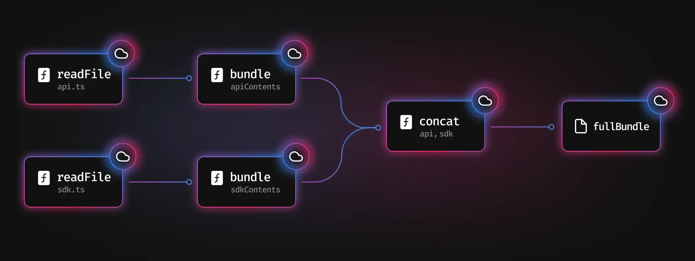
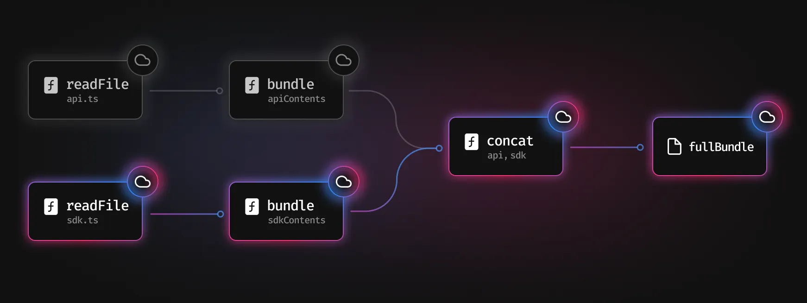
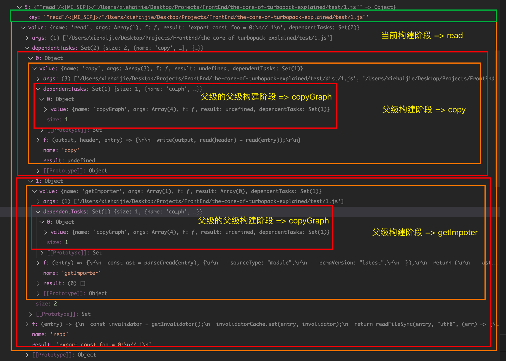
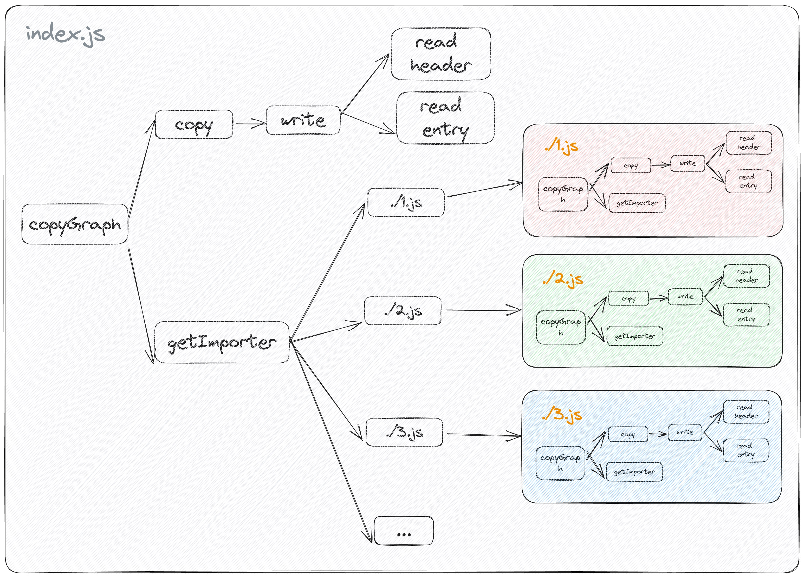

## 简述

> 来源： webpack 作者 Tobias Koppers 在 JS Nation
> JSNation 2023 上的 coding live 作品
> [The Core of Turbopack Explained (Live Coding)](https://portal.gitnation.org/contents/the-core-of-turbopack-explained-live-coding)

> 目的：解决 webpack 因大量查找缓存、验证失效缓存导致的开销过大问题

本文章/代码通过模拟一个最简构建过程来初探 Turbo Engine 的一些原理

## 如何工作

Turbo Engine 会将某些功能标记为*To be remember*。当这些函数被调用时，它会记住它们被调用的内容以及它们返回的内容。然后它将其保存在缓存中。

一个简单的 bundle 过程可以描述为读取源码，对源码进行构建，拼接构建产物形成最终产物 如下所示

> 
> 图出自 Turbopack 官网

修改 `sdk.ts` 的代码时，我们需要再次构建，再次拼接产物。此时，对于 `api.ts` 文件并未改动，我们将从缓存中读取 `api.ts` 的内容再拼接即可。从而减少了对于 `api.ts` 的读取与构建产生的开销。

> 
> 图出自 Turbopack 官网

对于一个具有成千上百个文件的巨应用，构建工具需要对每个文件进行路径解析、文件读取、源码构建。所有巧用缓存（记住每次函数的调用结果）将可节省大量开销。

这种解决方法能让 `Turbopack` 以极快的速度进行应用程序的增量构建，当文件改动，`devServer` 将快速接管并进行构建响应。

### 关于缓存

Turbo Engine 将这些内存缓存在运行内存中，而不是在硬盘内存中，这意味着，当启动 `devServer` 时，构建缓存将一直存在。直到关闭/停止 `devServer` 时，这些内存将被回收。

### 原理解释

最简构建过程

1. 读取入口文件源码、读取被拼接的模块 Header (/\*_ @copyright the-core-of-turbopack-explained _/)
2. 拼接构建模块
3. 输出构建产物
4. 解析入口文件的依赖

第 1,2,3 步我们统称为 `copy` 构建阶段，而后执行第 4 步 `getImporter` 构建阶段，如发现存在依赖文件，则递归执行此构建过程

```js
const main = task("main", () => {
  const baseDir = path.join(process.cwd(), "demo");
  const outDir = path.join(process.cwd(), "demo", "dist");
  const entry = path.join(baseDir, "/index.js");
  const header = path.join(process.cwd(), "demo", "header.js");
  copyGraph(baseDir, outDir, entry, header);
  log.enable && printCentered(`🔥🔥 首次构建完成 🔥🔥`);
});

// 构建主流程
const copyGraph = task("copyGraph", (baseDir, outDir, entry, header) => {
  const relPath = path.relative(baseDir, entry);
  const output = path.join(outDir, relPath);
  copy(output, header, entry);
  const importers = getImporter(entry);
  if (importers?.length > 0)
    for (const importer of importers) {
      copyGraph(baseDir, outDir, importer, header);
    }
});

// 解析依赖文件的路径
const getImporter = task("getImporter", (entry) => {
  const ast = parse(read(entry), {
    sourceType: "module",
    ecmaVersion: "latest",
  });
  return (
    ast.body
      .filter((node) => node.type === "ImportDeclaration")
      .map((node) => node.source.value)
      .filter((value) => {
        return value.startsWith("./");
      })
      .map((value) => path.join(path.dirname(entry), value)) ?? []
  );
});

// 输出构建产物
const copy = task("copy", (output, header, entry) => {
  write(output, read(header) + read(entry));
});
```

每个构建阶段都使用了 task 函数进行包裹，该函数的主要目的是对「相同入参与函数名」函数的执行结果进行缓存。

```js
const taskCache = new TupleMap();
export let currentTask = null;

export const task = (name, f) => {
  return (...args) => {
    let task = taskCache.get([name, ...args]) ?? null;
    if (!task) {
      task = {
        name,
        args,
        f,
        result: undefined,
        dependentTasks: new Set(),
      };
      task.result = wrapCurrentTask(task, () => logged(name, f, args));
      taskCache.set([name, ...args], task);
    }
    currentTask && task.dependentTasks.add(currentTask);
    return task.result;
  };
};
```

#### 关键函数与变量

`logged` 函数仅做日志打点用，在此不做过多解释

`currentTask` 变量用来记录当前所处哪个构建阶段，以方便记录各个构建阶段之间的依赖关系。

`currentTask` 变量记录还依赖 `withCurrentTask` 方法，具体操作为： 当前构建阶段的函数执行完毕后，会还原 `currentTask` 为其父级构建阶段，然后通过 `task.dependentTasks.add(currentTask)` 来记录当前构建阶段的父级构建阶段。

```js
// wrap current task to be able to track dependent tasks
const wrapCurrentTask = (task, f) => {
  const oldTask = currentTask;
  currentTask = task;
  try {
    return f();
  } finally {
    currentTask = oldTask;
  }
};
```

依据此，即可构建出一个完整的 taskCache，如下图所示

> 

#### 缓存节点属性解释

- name: 构建阶段名，Map 的 key 之一
- f: 构建执行函数
- args: 执行函数的入参，Map 的 key 之一
- dependentTasks: 代表该构建阶段函数的父级集合

现在我们已实现第一个功能，即官网中提及的 [Function-level caching](https://turbo.build/pack/docs/core-concepts#function-level-caching)

1. 对于重复路径的文件读取，我们可以直接从缓存中读取，而不用再次读取硬盘文件。
2. 对于重复路径的依赖文件解析，我们可以直接从缓存中读取，而不用再次使用 parser 进行依赖解析。
3. ...

但是，我们还需要解决一个问题，那就是如何判断文件是否改动，以及文件改动后，让缓存失效。

#### 思考

- 如何判断文件改动：我们简单通过 fs 模块的 watch 函数进行文件监听。
- 如何使缓存失效：当文件改动后，再次进行文件读取 read 工作，并且执行冒泡操作，即递归执行父级构建阶段的函数，getImporter, write...，同时进行缓存的更新。

#### 如何实现

先创建一个缓存失效函数，目的是重新执行 read 函数阶段，使缓存失效，更新 `task.result`，如果 task.result 发生变化，则递归执行父级构建阶段的函数。

```js
export const invalidate = (task) => {
  const oldTaskResult = task.result;
  // recalculate task
  logged(
    task.name,
    () => {
      task.result = wrapCurrentTask(task, () => {
        return task.f(...task.args);
      });
    },
    task.args
  );
  // invalidate dependent tasks
  if (JSON.stringify(oldTaskResult) !== JSON.stringify(task.result)) {
    if (task.dependentTasks.size > 0) {
      for (const dependentTask of task.dependentTasks) {
        invalidate(dependentTask);
      }
    }
  } else {
    log.enable && printCentered(`🔥🔥 ${task.name} no change 🔥🔥`);
  }
};
```

将 `currentTask` 作为入参传入 `invalidate` 缓存失效函数中，即可明确 该入口文件 & 该构建阶段 的父级构建链，从而实现冒泡/增量构建中的一环。

```js
export const getInvalidator = () => {
  if (!currentTask) log.enable && console.log(">>>>>no task");
  // need to cache by another variable because currentTask is changing
  const task = currentTask;
  return () => invalidate(task);
};
```

下一步，让缓存失效函数与文件监听函数进行关联，当文件改动时，执行缓存失效函数。

借助『以 filepath 作为 key 的缓存 `invalidatorCache` 』来记录每个文件的 `read` 构建阶段的缓存失效函数。文件改动后，通过 `invalidatorCache` 找到对应的缓存失效函数，执行缓存失效函数来实现目标。

```js
export const read = task("read", (entry) => {
  const invalidator = getInvalidator();
  // 注册当前文件的缓存失效函数
  invalidatorCache.set(entry, invalidator);
  return readFileSync(entry, "utf8", (err) => {
    console.error(">>>>>>>read error", err);
  });
});
```

```js
watch(process.cwd(), { recursive: true }, (eventType, filename) => {
  if (!filename) return;
  filename = resolve(filename);
  // 找到对应的缓存失效函数
  const invalidator = invalidatorCache.get(filename);
  invalidator &&
    setTimeout(() => {
      invalidatorCache.delete(filename);
      log.enable && console.time("file change");
      // 执行缓存失效函数
      invalidator();
      log.enable && console.timeEnd("file change");
    }, 100);
});
```

通过以上几个函数，我们即可做到 文件改动 => 使缓存失效 => 增量构建。

下面我们以一个 demo 来解释一下全链路

```js
// test/index.js
import { foo as foo1 } from "./1.js";
import { foo as foo2 } from "./2.js";
import { foo as foo3 } from "./3.js";
import { foo as foo4 } from "./4.js";
import { foo as foo5 } from "./5.js";
import { foo as foo6 } from "./6.js";
import { foo as foo7 } from "./7.js";
import { foo as foo8 } from "./8.js";
import { foo as foo9 } from "./9.js";
import { foo as foo10 } from "./10.js";
import { foo as foo11 } from "./11.js";
import { foo as foo12 } from "./12.js";
```

> 第一次执行构建过程，流程如下
> 

#### 当 `./1.js` 文件改动时，执行如下

- 重读取 `./1.js` 文件，发现 `task.result` 与之前结果不一致，更新缓存，进行冒泡，执行父级构建链
- 执行 `copy` 构建阶段，`writeFile` 输出构建结果，`task.result` 为 undefined，与之前结果一致，结束执行
- 执行 `getImporter` 构建阶段，`task.result` 为 [] 空数组，JSON.stringify 后，与之前结果一致，结束执行

#### 当 `index.js` 文件改动，如新增依赖 `import` 语句

```js
import { foo as foo14 } from "./14.js"`
```

- 重读取 `./index.js` 文件，发现 `task.result` 与之前结果不一致，更新缓存，进行冒泡，执行父级构建链
- 执行 `copy` 构建阶段，`writeFile` 输出构建结果，`task.result` 为 undefined，与之前结果一致，结束执行。
- 执行 `getImporter` 构建阶段，`task.result` 数组新增一项，与之前结果不一致，进行冒泡。
- 执行 `./index.js` 的 `copyGraph` 构建阶段，`./1.js` 至 `./13.js` 的构建阶段皆被缓存，不再执行。
- 执行 `./14.js` 的 `copyGraph` 构建阶段，未命中缓存，执行 `copy` 与 `getImporter` 构建阶段，并进行 task 缓存。
- `./index.js` 的 `copyGraph` 构建阶段的`task.result` 为 undefined，与之前结果一致，结束执行。

## 结语

欢迎 🔗 Fork 或 ❤️ Star 本仓库 [the-core-of-turbopack-explained](https://github.com/haijie-x/the-core-of-turbopack-explained) 共同探讨与学习。

## 参考

- https://portal.gitnation.org/contents/the-core-of-turbopack-explained-live-coding
- https://turbo.build/pack/docs/core-concepts
